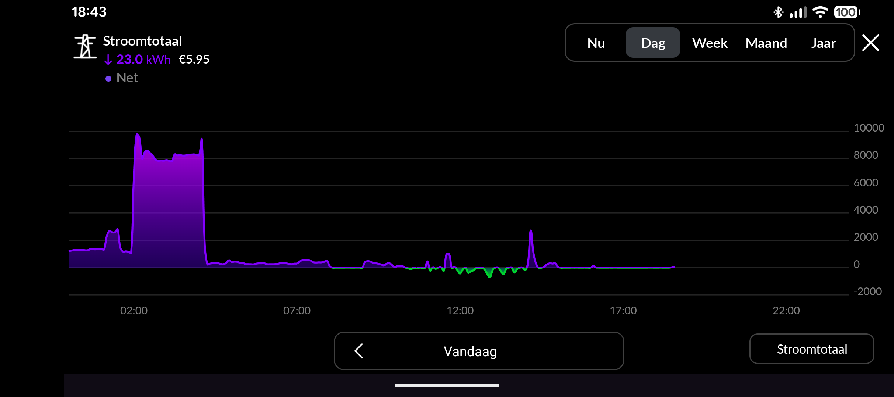
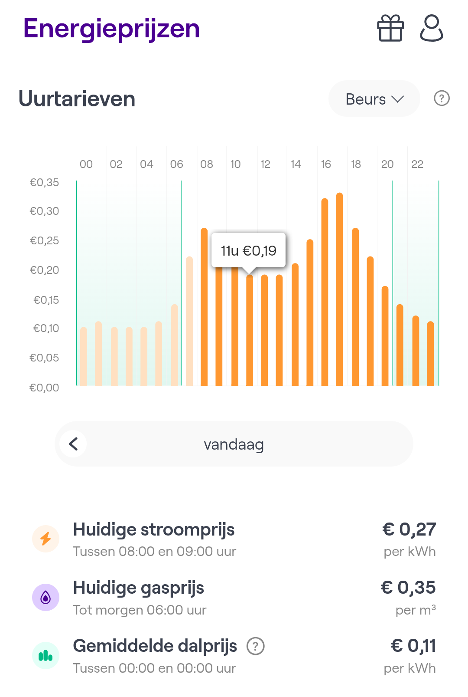

# HomeWizard Dynamic Battery Control for Home Assistant  
[](LICENSE)

A complete, modular automation system that turns the [**HomeWizard Plug-In Battery**](https://www.homewizard.com/) into a *smart, price-aware, PV-aware* device — even though HomeWizard does **not** yet support “charge-only” or “discharge-only” modes.

This project contains two automation strategies (simple & advanced), full documentation, and examples showing how these automations keep your power usage flat while exploiting dynamic electricity prices.

---

# 🌍 Why this project exists

HomeWizard currently exposes only **three modes** for the Plug-In Battery:

- **zero** — charge or discharge to keep net usage at 0 W  
- **to_full** — charge to 100%  
- **standby** — do nothing (not charge, nor discharge)  

There is *no mode* for:

- **charge only (block discharge)**  
- **discharge only (block charge)**  

This makes automation **necessary** if you want to:

- charge the battery when power is cheap  
- discharge when prices are high  
- prefer grid charging when there is no sun  
- avoid draining the battery during large appliance loads, especially during cheap hours  
- avoid overloading during EV charging  
- keep behaviour stable when prices fluctuate  

This repository provides a solution to that missing functionality, fully configurable.

---

# 📸 Examples

### 1. Flattened consumption curve (HomeWizard app example)
*Shows how the Plug-In Battery kept household usage flat while the EV charged during the night.*



### 2. Daily electricity prices curve
*Shows a daytime mini-peak, a midday dip, and a strong evening price spike.*



---

# 📦 Repository Structure

```
homewizard-dynamic-battery/
│
├── automations/
│   ├── simple-homewizard-battery-price.yaml
│   ├── advanced-homewizard-battery-price.yaml
│   └── advanced_pricing_sensors.yaml
│
├── docs/
│   ├── logictree.md
│   └── price-curve-percentile-approach.md
│
├── README.md   ← this file
└── LICENSE
```

---

# ⚡ Automations

The repository contains **two** fully documented automations.

---

## ✅ Simple Automation  
📄 [**`automations/simple-homewizard-battery-price.yaml`**](automations/simple-homewizard-battery-price.yaml)

Uses:  
- fixed *cheap* threshold = `lowest_price + 0.03 EUR`  
- fixed *expensive* threshold = `highest_price − (spread / 2.5)`  

Advantages:  
- no template sensors  
- easy to understand and adjust  
- perfect for users who want quick setup  

This automation still includes:

- heavy load protection  
- super-heavy load override  
- SoC-aware behaviour  
- PV-aware charging  
- arbitrage profitability logic  

---

## 🔓 Unlocking Battery Group Mode in Home Assistant

For both the simple and advanced automation, the battery group mode must be unlocked first.  

The battery group mode (“Battery group mode”) is not located under the battery itself, but under the **P1 meter**. This entity is disabled by default.  

In general, it works like this (see also the [Home Assistant documentation on the HomeWizard integration](https://www.home-assistant.io/integrations/homewizard/#plug-in-battery)):

1. In Home Assistant, go to **Settings → Devices & Services**.
2. Open the **HomeWizard Energy** integration.
3. Click on your **P1 meter** device.
4. In the **Configuration** section, you will see a link such as `+1 disabled entity` (or another number).
5. Click on it, open the “Batterijgroepmodus” entity and click the gear icon in the top-right corner.
6. Enable the entity and click Save.
7. After ~30 seconds it will appear as a normal entity, for example `select.p1_meter_batterygroupmode`.

You can now also place this entity on a dashboard to see what your automation is doing.

---

## 👷👷‍♀️ Creating an Automation in Home Assistant

We will create a single automation that:

* checks the current ENTSO price and the daily curve (lowest/highest price);
* checks the state of charge (SoC) and the import/export from the P1 meter;
* based on that, selects the mode `zero`, `to_full`, or `standby`.

### Step 1 – Create an empty automation

1. Go to **Settings → Automations & Scenes → Automations**.
2. Click **+ Add automation**.
3. Choose **Empty automation**.
4. At the top, enter a name, for example:  
   `HomeWizard battery based on energy price`
5. Click **Save** once at the bottom.

### Step 2 – Open the YAML editor

1. In the same automation, click the **three dots (⋮)** in the top-right corner.
2. Choose **Edit in YAML**.
3. Replace the entire contents with the YAML below and adjust the `entity_id`s to match your installation if needed.

📄 [**`automations/simple-homewizard-battery-price.yaml`**](automations/simple-homewizard-battery-price.yaml)

---

## 🔥 Advanced Automation  

This version uses **statistical analysis** of the daily ENTSO-e price curve to compute dynamic thresholds.

The full explanation and how to install can be found here:

📄 [**`docs/price-curve-percentile-approach.md`**](docs/price-curve-percentile-approach.md)

---

### 🪾 Full decision tree

The decision tree provides a **clear, human-readable overview** of how the automation behaves in every possible situation.  
It is the conceptual model behind both the simple and advanced automations.  
It reflects the intended behaviour in real-world scenarios, independent of implementation details.

While the YAML files contain the precise implementation, the structure of the logic can be difficult to follow directly from code.  

Using a decision tree helps for:

#### 1. **Clarity**
It breaks complex logic into intuitive branches. For example "What happens during cheap hours?"  

#### 2. **Transparency**
Every condition that affects the battery state is shown explicitly, like heavy and super-heavy load overrides and thresholds for cheap / midzone / expensive hours  

#### 3. **Safety and Predictability**
The tree makes it easy to verify that:  
- the battery stays out of the way during EV charging  
- it always uses solar when available  
- it avoids unnecessary cycling near 100% SoC  
- it only performs arbitrage when it is profitable

See the decision tree in [`docs/logictree.md`](docs/logictree.md)  

---

# 👤 Author & License

**Author:** Joost Smits  
**GitHub:** https://github.com/eurojojo  
**License:** MIT  


You are free to use, modify and distribute this work, provided attribution is preserved.

---

# 🤝 Contributing

Suggestions, improvements and pull requests are welcome!  
This automation continues to improve as HomeWizard updates its API and as more users adopt dynamic charging strategies.

